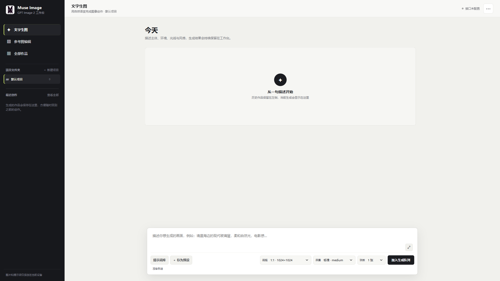
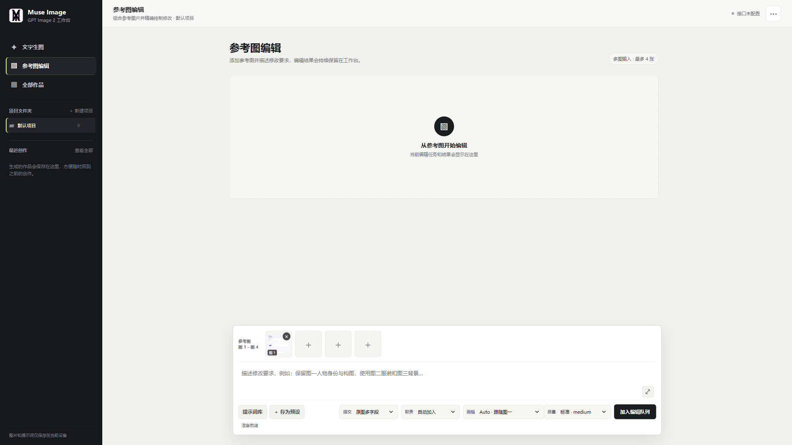
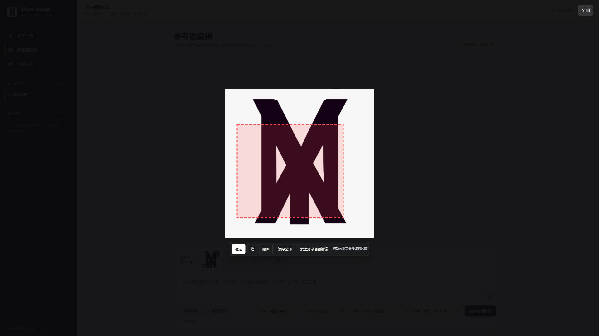

# Muse Image

一个面向 Windows 桌面端的 GPT Image 2 图像创作工作台。支持文字生图、多参考图编辑、批量生成、项目管理、提示词复用和局部标注，不依赖 Python 或 Node.js 运行环境。



## 使用视频

[点击观看 Muse Image 完整使用演示（约 2 分 10 秒）](https://github.com/GuiYi-Xi/Muse-Image/releases/download/v1.0.2/Muse-Image-demo.mp4)

## 功能

- 文字生图，一次生成 1-4 张图片
- 最多 4 张参考图的组合编辑
- 生成任务状态、取消、失败提示和完整画幅预览
- 画幅、质量和参考图提交策略控制
- 图片框选、画笔标注、单步撤回和清除全部
- 将标注结果直接发送到参考图编辑
- 本地项目文件夹、作品历史和提示词预设
- 查看、复制、复用提示词以及下载原图
- 自定义兼容接口的 Base URL 与 API Key

## 界面

### 参考图编辑

四个固定参考图槽位按图 1 到图 4 排列，编辑任务和结果直接显示在中央工作区。



### 局部标注

支持框选与画笔标注，可撤回、清除全部，并将带标注的图片发送到参考图编辑。



## 快速开始

### 直接运行

1. 下载或克隆仓库。
2. 双击 `START_WINDOWS.cmd`。
3. 浏览器将打开 `http://127.0.0.1:8765/index.html`。如果端口被占用，程序会自动尝试 8766-8785。
4. 点击右上角 `...`，填写兼容接口的 Base URL 和 API Key。

项目内已包含预编译的 `GPT_Image_Server.exe`，Windows 10/11 无需额外安装运行环境。使用期间请保持启动窗口开启。

### 从源码编译本地服务

修改 `portable_server.c` 后，可通过 MinGW-w64 编译：

```bash
x86_64-w64-mingw32-gcc -O2 -Wall -o GPT_Image_Server.exe portable_server.c -lwinhttp -lws2_32 -lshell32
```

也可以在已配置该编译器的环境中运行 `BUILD_SERVER.cmd`。

## 项目结构

```text
index.html              单文件前端和主要业务逻辑
portable_server.c       Windows 本地静态服务与 API 代理
GPT_Image_Server.exe    预编译 Windows 可执行文件
START_WINDOWS.cmd       启动脚本
BUILD_SERVER.cmd        编译脚本
muse-logo.png           应用图标
```

## 数据与安全

- 仓库不包含任何 Base URL 或 API Key。
- 接口配置、提示词预设和作品历史仅保存在浏览器本地存储中。
- 本地服务只监听 `127.0.0.1`，不会主动暴露到局域网。
- 不要公开带有密钥的设置截图或浏览器用户数据目录。
- 生成请求可能产生接口费用，提交前请确认所使用服务的计费规则。

## 开发

前端由原生 HTML、CSS 和 JavaScript 构成，修改 `index.html` 后刷新页面即可。只有修改 `portable_server.c` 时才需要重新编译可执行文件。

更完整的 Windows 开发说明见 [README_电脑开发版.md](README_电脑开发版.md)。

## 说明

本项目是独立的开源客户端，不隶属于或代表 OpenAI。`GPT Image 2` 及相关名称的权利归各自权利人所有。使用者应自行确保所连接接口、模型和生成内容符合服务条款及当地法律。

## License

[MIT](LICENSE)
